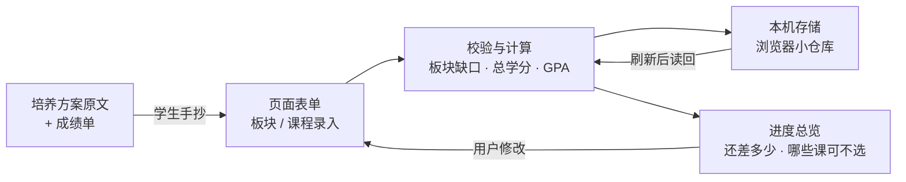

# TECH_DESIGN.md —— 学分规划助手 · 技术设计（一期）

> 依据：`PRD.md`（20 条验收标准 + 数据规则）　｜　撰写日期：2026-09-20（Day 5）
> 项目一句话：输入已修课程，按板块算清"修够没有、还差多少"，判断哪些课必须选、哪些不必再选。

## 〇、技术路线（一句话）

> **技术路线：原生 HTML / CSS / JavaScript 单页应用 —— 数据存在浏览器本机存储 —— 部署到 GitHub Pages 静态托管；一期不使用后端、不使用云数据库、不引入任何构建工具。**

**为什么是这四个选择**（一句话版理由）：与 PRD"数据不上传服务器"完全一致；零安装零账号零成本；一人份的算账需求用不上服务器；20 天工期与零基础的约束下，链路越短越不容易翻车。

## 一、方案比较（3 套）与推荐理由

| 维度 | 方案一 · 纯前端 + 本机存储（**采用**） | 方案二 · 全栈云版（示范路线） | 方案三 · 一期本地 + 二期云端（渐进） |
|---|---|---|---|
| 前端 | 原生 HTML/CSS/JS，无需安装 | React + Vite（需 `npm install`、学组件） | 与方案一相同 |
| 后端 | 无 | CloudBase Node.js 云函数 | 一期无，二期加 |
| 数据库 | 浏览器本机存储 | CloudBase PostgreSQL | 一期本机，二期换云数据库 |
| 部署 | GitHub Pages（免费静态托管） | CloudBase 静态网站托管 | 同方案一 |
| 预计工期 | 约 5 天 | 8–12 天 | 约 5 天（+文档预留） |
| 与 PRD 一致性 | ✅ 完全一致 | ❌ 冲突（需改 PRD 与验收标准） | ✅ 一致 |
| 主要风险 | 数据不跨设备、清缓存会丢 | 三层链路（页面→云函数→数据库）任一环报错都要排查；需开通腾讯云环境 | 文档多写一节预留说明 |

**推荐：方案一**，并在文档中采用方案三的"预留"写法（数据模型与函数清单按可迁移方式设计）。

**推荐理由（4 条）**：
1. 与 PRD 完全吻合——PRD 明确"数据不上传服务器"，选方案二必须先改 PRD 与验收标准。
2. 工期最稳——5 天 vs 8–12 天，Day 7 就要交付 MVP，省下的时间用于调试与打磨。
3. 符合现状——零基础阶段引入 React、云函数会带来与学习主线无关的概念（组件、构建、跨域、环境变量）。
4. 需求不支持——一期是单人在自己电脑上算账，不需要多人共享、账号体系或跨设备同步。

**取舍（放弃了什么）**：

| 放弃 | 换来 | 以后怎么补 |
|---|---|---|
| 数据跨设备同步、云端备份 | Day 7 准时交付、零成本零账号 | 二期上 CloudBase（与"培养方案文件解析"同批做） |
| React 技术栈 | 不学额外框架也能完成产品 | 以后有需要再学 |
| 数据库表与 HTTP 接口写法 | 不写服务器代码 | 本文档用"数据结构 + 函数清单"对应，二期可平移 |

**备选路线（方案二）什么情况下才值得上**：出现"多人共用一份数据""手机上也要看同一份账""要自动解析培养方案文件"这三类需求中的任意一个时。

## 二、技术栈清单（各是什么、有什么用、优劣势）

| 技术 | 是什么 | 在本项目里干什么 | 优势 | 劣势 |
|---|---|---|---|---|
| HTML | 网页的骨架 | 搭出三大区块：我的板块 / 课程列表 / 进度总览 | 浏览器直接认，零学习门槛 | 结构写乱了自己看不懂 |
| CSS | 网页的皮肤 | 卡片样式、红绿标识、手机适配 | 改一行看一眼，反馈最快 | 手机适配要额外调试 |
| JavaScript | 网页的动作 | 录入、计算缺口、读存数据、渲染 | 浏览器自带，无需安装 | 代码量一大就难维护（一期约 300–500 行，可控） |
| 浏览器本机存储（localStorage） | 浏览器自带的小仓库（键值对） | 保存板块与课程数据，刷新不丢 | 免服务器免账号，容量约 5MB（本项目数据远小于此） | 按域名隔离、清缓存即丢、不能跨设备 |
| Git / GitHub | 版本管理 + 云端仓库 | 记录每天改动、上传代码 | 有历史可回退 | 需要记住几条命令（已配好代理与凭证） |
| GitHub Pages | 免费静态托管 | 把 `index.html` 等文件变成可访问网址 | 免费、无需额外账号 | 只发静态文件；换域名会影响本机存储的归属 |

## 三、项目结构

> 说明：**只列出真实存在的文件与本项目计划创建的文件**，不凭空造目录。计划项标注"计划创建"。

```
my-first-project/
├── index.html          ← 已有（Day 2 占位页，Day 7 改造成主页面）
├── app.js              ← 计划创建（Day 7）：页面交互与计算逻辑
├── style.css           ← 计划创建（Day 7）：样式与手机适配
├── store.js            ← 计划创建（Day 7）：本机存储的读写封装
├── research.md         ← 已有（Day 3）：需求研究
├── PRD.md              ← 已有（Day 4）：产品需求与验收标准
├── TECH_DESIGN.md      ← 本文档（Day 5）
├── AGENTS.md           ← 已有（Day 1）：项目规则
└── .gitignore          ← 已有（Day 2）：忽略规则（含 .env）
```

**结构与 PRD 页面/功能的对应关系**（一个页面、三个区块，不做多页面）：

| PRD 功能 | 页面区块 | 主要文件 |
|---|---|---|
| F1 板块设置（含特殊条件备注） | 区块 A「我的板块」 | index.html + app.js |
| F2 课程录入（含已修/计划修状态） | 区块 B「课程列表」 | index.html + app.js |
| F3 板块缺口与选课结论 | 区块 C「进度总览」 | app.js |
| F4 总分与 GPA（规则可切换） | 区块 C 内的数字区 | app.js |
| F5 本地保存（含"数据仅存本机"提示） | 全局 | store.js |
| F6 手机可用 | 全局 | style.css |

## 四、数据模型（本机存储中的数据结构）

> 说明：一期没有数据库，因此"数据模型"= **浏览器本机存储里保存的两组数据**。二期上云时，这两组数据可直接对应到云数据库的两张表。

**存储键名**：`creditPlanner.v1`

```
creditPlanner.v1 = {
  version: 1,
  categories: [ 板块... ],
  courses:    [ 课程... ]
}
```

**板块 category**

| 字段 | 类型 | 说明 | 校验规则 |
|---|---|---|---|
| id | 字符串 | 唯一标识（时间戳生成） | 不可重复 |
| name | 字符串 | 板块名，用户自定义（如"专业选修"） | 非空、去首尾空格、不超过 20 字 |
| requiredCredits | 数字 | 该板块要求学分 | 0.5 的整数倍；**允许为空**（为空显示"未设置"） |
| note | 字符串 | 特殊条件备注（如"须含 2 学分艺术类"） | 可为空，不超过 100 字 |

**课程 course**

| 字段 | 类型 | 说明 | 校验规则 |
|---|---|---|---|
| id | 字符串 | 唯一标识 | 不可重复 |
| name | 字符串 | 课程名 | 非空、去首尾空格、不超过 30 字 |
| credits | 数字 | 学分 | 0.5 的整数倍（如 0.5 / 1.5 / 3） |
| categoryId | 字符串 | 所属板块 | 必须指向已存在的板块 |
| status | 字符串 | `done`（已修）或 `planned`（计划修） | 二选一 |
| score | 数字或空 | 成绩（0–100 整数） | 已修时可选填；低于 60 视为不及格，**不计入已修学分**；为空则不计入 GPA |

**一期不做**：学期字段、成绩单导出、多学期对比（见 PRD 第五节）。

## 五、接口清单（一期为页面内部函数）

> 说明：一期没有服务器，因此"API 列表"= **页面内部函数清单**。二期上云时，下表前六个函数改为云函数（同名），页面调用方式从直接调用改为网络请求。

| 函数（拟命名） | 作用 | 输入 | 输出 |
|---|---|---|---|
| `loadData()` | 从本机存储读取全部数据 | 无 | `{categories, courses}`；无数据时返回空结构 |
| `saveData(data)` | 把数据写回本机存储 | 完整数据结构 | 成功/失败（失败给出可读提示） |
| `addCategory(u)` / `updateCategory(u)` / `removeCategory(id)` | 板块的增改删 | 板块对象或 id | 更新后的列表；删除时若板块下有课程，先提示处理方式 |
| `addCourse(u)` / `updateCourse(u)` / `removeCourse(id)` | 课程的增改删 | 课程对象或 id | 更新后的列表 |
| `calcCategoryStats(data)` | 计算每个板块的已修/要求/缺口 | 完整数据 | `[{categoryId, doneCredits, requiredCredits, gap}]`；要求未填时 `requiredCredits = null` |
| `calcOverall(data)` | 计算已修总学分、加权平均分、GPA | 完整数据 + 当前换算规则 | `{totalCredits, weightedAvg, gpa}`；无有效成绩时 GPA 显示"—" |
| `validateCourse(input)` / `validateCategory(input)` | 录入校验 | 输入对象 | 通过或错误原因（可直接显示给用户） |
| `renderCategories()` / `renderCourses()` / `renderOverview()` | 渲染三个区块 | 计算后的数据 | 页面内容 |
| `exportData()` / `importData(json)` | 导出/导入全量数据 | 无 / JSON 文本 | **二期功能**（见第九节待办） |

## 六、前后端数据流

### 数据流图（Mermaid，GitHub 上会自动渲染）



### 同一张图的纯文本版（任何编辑器都能看清）

```
[培养方案原文 + 成绩单]
        │  学生手抄
        ▼
[页面表单：板块设置 / 课程录入]
        │
        ▼
[校验与计算：板块缺口 · 已修总学分 · 加权平均 · GPA]
        │                        ▲
        │  保存                   │  刷新页面后读回
        ▼                        │
[本机存储（浏览器小仓库）] ───────┘
        │
        ▼
[进度总览：各板块还差多少 · 哪些课可不选 · 当前 GPA]
        │  用户修改
        └────────────► 回到页面表单
```

### 数据从哪来、到哪去（一句话）

> 数据从我的培养方案和成绩单里来，我手抄进页面；算完的结果存在浏览器本机，下次打开页面读回来继续用——**全程不经过任何服务器**。

### 前端与"后端"的分工（一期）

| 角色 | 一期由谁承担 | 说明 |
|---|---|---|
| 前端（界面与交互） | `index.html` + `style.css` + `app.js` | 录入、展示、红绿标识 |
| 后端（业务运算） | **由前端内部的 JavaScript 函数承担** | 缺口计算、GPA 换算、校验——逻辑上属于"后端职责"，物理上跑在浏览器里 |
| 数据库 | **由浏览器本机存储承担** | 相当于一个只属于你这台电脑的小仓库 |

## 七、错误处理

| 出错场景 | 处理方式 | 用户看到什么 |
|---|---|---|
| 学分数值不合法（非 0.5 倍数、负数、文字） | 输入框即时校验，不写入数据 | 输入框下方红字提示"学分需为 0.5 的整数倍" |
| 成绩超出 0–100 或非整数 | 同上 | "成绩需为 0–100 的整数" |
| 课程名 / 板块名为空 | 阻止保存 | "请填写名称" |
| 未选所属板块就保存课程 | 阻止保存并提示 | "请先创建板块，或选择一个板块" |
| 删除仍有课程的板块 | 先提示影响范围，让用户确认 | "该板块下有 3 门课程，删除后这些课程将变成'未归类'" |
| 本机存储写入失败（隐私模式 / 空间不足） | 捕获失败，页面顶部提示，数据仍保留在当前页面内 | "保存失败：数据仅在本次打开期间有效，请勿关闭页面" |
| 本机存储数据损坏（手工改坏 / 版本不符） | 解析失败时保留原始文本备份，退回空数据结构 | "数据读取失败，已保留原始内容备份，可联系开发者恢复" |
| 无任何已修课程时算 GPA | 不做除法，直接返回空值 | GPA 显示"—"，不显示 0 或报错 |
| 板块"要求学分"未填 | 不参与缺口计算 | 板块显示"未设置"（**不显示为 0**） |
| 已修超出要求 | 缺口按 0 处理 | 显示"已修够（超出 X 学分）"，**不出现负数** |

## 八、环境变量

| 场景 | 需要什么 | 说明 |
|---|---|---|
| 一期开发与运行 | **不需要任何环境变量** | 纯静态页面，无密钥、无接口地址 |
| 一期部署（GitHub Pages） | 不需要配置 | 推送到仓库后开启 Pages 即可；仅自定义域名才会用到 `CNAME` |
| 二期（CloudBase 云端） | 预留命名：`CLOUDBASE_ENV_ID`、数据库连接串 | **只能写在服务器端（云函数环境变量）**；绝不写进前端代码；本地文件 `.env` 已在 `.gitignore` 中，永不提交 |

## 九、迁移与注意事项

1. **数据结构版本**：存储里带 `version` 字段（当前 `1`）。以后改结构必须同时写一段"旧版→新版"的转换逻辑，否则老用户数据会读不出来。
2. **一期→二期上云的迁移顺序**：先在页面里做"导出 JSON"，再在云端做"导入"，最后切换为云端读写。**没有导出功能之前不要动云端**，否则数据搬不过去。
3. **换仓库名 / 换域名要注意**：本机存储按"域名"隔离。仓库改名或换域名后，浏览器会认为这是个新网站，**旧数据不会跟过去**——迁移前先导出 JSON。
4. **相对路径**：GitHub Pages 的网址带仓库子路径（`用户名.github.io/仓库名/`），页面里引用资源必须用相对路径，不要写以 `/` 开头的绝对路径。
5. **清缓存会丢数据**：页面必须始终显示"数据仅保存在本机浏览器"的提示（PRD 验收标准第 20 条）。
6. **提交规范**：`.env`、密钥、连接串永不进仓库；二期引入依赖时 `node_modules/` 也要忽略（已在 `.gitignore` 中）。

## 十、尚未决定的地方（⚠️ 待确认与临时假设）

> 以下问题我**没有答案，先按临时假设推进**，等你（或老师）确认后再改这一节。

| # | 待确认问题 | 临时假设 | 影响 |
|---|---|---|---|
| 1 | 二期是否确定改用 CloudBase 云端 | 假设会，因此本文档按"可平移"方式设计数据结构 | 若不上云，第九节第 2 条作废，其余不受影响 |
| 2 | 一期要不要加"导出/导入 JSON"（防止清缓存丢数据） | 假设**不加**（不在一期功能清单内），列入二期待办第 1 项 | 若加，约多半天工期，需同步改 PRD |
| 3 | GPA 换算规则保留哪几套公式 | 假设三套：4.0 制、5.0 制、等级制（优/良/中/及格） | 具体换算式需以本校教务处规定核对，页面需标注"以本校规定为准" |
| 4 | 板块与课程的数量上限 | 假设各 50 条，超出时提示 | 影响渲染性能与校验提示文案 |
| 5 | 是否需要"学期"字段 | 假设**不需要**（PRD 已明确一期不做多学期对比） | 若需要，数据结构要加字段并改动计算 |

## 十一、如何本地运行与验证（Day 7 追加）

> 本节就是"运行命令存档"：以后换电脑、换时间想再跑起来，照这里敲即可。

**运行环境要求**：只要有一个能起"静态文件服务"的工具就行。本项目**不需要安装任何依赖**、不需要 Node、不需要数据库、不需要密钥——因为它是纯静态页面。

**启动（Windows CMD，两行）**：

```
cd /d C:\Users\w3224\Desktop\my-first-project
python -m http.server 8000
```

看到 `Serving HTTP on 0.0.0.0 port 8000 ...` 就表示起来了。然后浏览器打开：

```
http://localhost:8000
```

**停止**：在那个 CMD 窗口按 `Ctrl + C`，或直接关闭窗口。

**为什么非要起这个服务**：直接双击 `index.html` 也能打开页面，但地址栏是 `file://...`；用本地服务器访问地址栏才是 `localhost`，也才能验证"和将来部署到网上是同一个访问方式"。

**打开后应该看到**（一期 MVP 的完整样子）：

- 标题「学分规划助手」和一句话说明
- 三个区块：我的板块（可增删改）、课程列表（可增删改）、进度总览（各板块缺口 + 选课结论 + 总学分/加权平均/GPA）
- 底部黄条提示："数据只保存在本机浏览器，不上传服务器"
- 详情页里的默认值：第一个板块要求学分留空时显示"要求学分：未设置"

**数据自检**（想确认数据存在哪里时用）：按 `F12` → Console 标签 → 输入

```js
CreditPlanner.loadData()
```

应返回 `{data: {version: 1, categories: Array(n), courses: Array(n)}, error: null}`。

**常见问题**：

| 现象 | 原因 | 处理 |
|---|---|---|
| 控制台报 `/favicon.ico` 404 | 浏览器会自动索要站点图标，本项目没有这个文件 | **无害，可忽略**；若要它消失，在 `<head>` 加 `<link rel="icon" href="data:,">` |
| `python` 不是内部或外部命令 | Python 没在 PATH 里 | 改用 Python 完整路径运行，或把 Python 目录加入 PATH |
| `Address already in use` / 端口被占用 | 8000 已被别的程序占用 | 换端口：`python -m http.server 8001`，浏览器同步改成 8001 |
| 改了代码但页面没变 | 浏览器缓存了旧文件 | `Ctrl + F5` 强刷 |
| 刷新后数据没了 | 本机存储按"域名+端口"隔离，或浏览器数据被清理 | 用同一个地址访问；长期保存需导出（导出功能属二期待办） |

**部署（后续天数再做）**：一期计划用 GitHub Pages 静态托管——把文件推到仓库后在仓库设置里开启 Pages 即可；页面里的资源都已使用相对路径，适应 GitHub Pages 的子路径。

---

> 本文档描述**怎么实现**；功能范围以 `PRD.md` 为准，数据从哪来、到哪去以本文档第六节为准。二期相关内容仅作预留，不在一期范围内。
