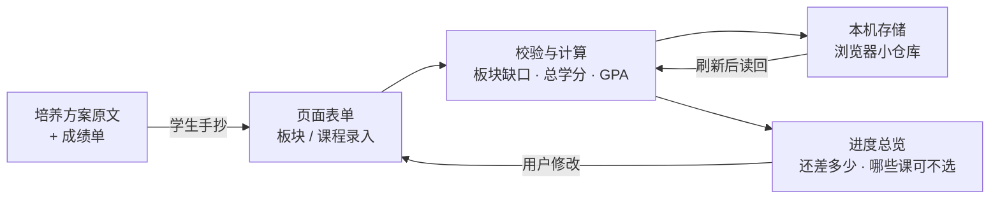

# TECH_DESIGN.md —— 学分规划助手 · 技术设计（一期）

> 依据：`PRD.md`（20 条验收标准 + 数据规则）　｜　撰写日期：2026-09-20（Day 5）
> 项目一句话：输入已修课程，按板块算清"修够没有、还差多少"，判断哪些课必须选、哪些不必再选。

## 〇、技术路线（一句话）

> **技术路线：原生 HTML / CSS / JavaScript 单页应用 —— 数据存在浏览器本机存储 —— 部署到 GitHub Pages 静态托管；一期不使用后端、不使用云数据库、不引入任何构建工具。**

**为什么是这四个选择**（一句话版理由）：与 PRD"数据不上传服务器"完全一致；零安装零账号零成本；一人份的算账需求用不上服务器；20 天工期与零基础的约束下，链路越短越不容易翻车。

## 一、方案比较（3 套）与推荐理由

| 维度 | 方案一 · 纯前端 + 本机存储（**采用**） | 方案二 · 全栈云版（示范路线） | 方案三 · 一期本地 + 二期云端（渐进） |
|---|---|---|---|
| 前端 | 原生 HTML/CSS/JS，无需安装 | React + Vite（需 `npm install`、学组件） | 与方案一相同 |
| 后端 | 无 | CloudBase Node.js 云函数 | 一期无，二期加 |
| 数据库 | 浏览器本机存储 | CloudBase PostgreSQL | 一期本机，二期换云数据库 |
| 部署 | GitHub Pages（免费静态托管） | CloudBase 静态网站托管 | 同方案一 |
| 预计工期 | 约 5 天 | 8–12 天 | 约 5 天（+文档预留） |
| 与 PRD 一致性 | ✅ 完全一致 | ❌ 冲突（需改 PRD 与验收标准） | ✅ 一致 |
| 主要风险 | 数据不跨设备、清缓存会丢 | 三层链路（页面→云函数→数据库）任一环报错都要排查；需开通腾讯云环境 | 文档多写一节预留说明 |

**推荐：方案一**，并在文档中采用方案三的"预留"写法（数据模型与函数清单按可迁移方式设计）。

**推荐理由（4 条）**：
1. 与 PRD 完全吻合——PRD 明确"数据不上传服务器"，选方案二必须先改 PRD 与验收标准。
2. 工期最稳——5 天 vs 8–12 天，Day 7 就要交付 MVP，省下的时间用于调试与打磨。
3. 符合现状——零基础阶段引入 React、云函数会带来与学习主线无关的概念（组件、构建、跨域、环境变量）。
4. 需求不支持——一期是单人在自己电脑上算账，不需要多人共享、账号体系或跨设备同步。

**取舍（放弃了什么）**：

| 放弃 | 换来 | 以后怎么补 |
|---|---|---|
| 数据跨设备同步、云端备份 | Day 7 准时交付、零成本零账号 | 二期上 CloudBase（与"培养方案文件解析"同批做） |
| React 技术栈 | 不学额外框架也能完成产品 | 以后有需要再学 |
| 数据库表与 HTTP 接口写法 | 不写服务器代码 | 本文档用"数据结构 + 函数清单"对应，二期可平移 |

**备选路线（方案二）什么情况下才值得上**：出现"多人共用一份数据""手机上也要看同一份账""要自动解析培养方案文件"这三类需求中的任意一个时。

## 二、技术栈清单（各是什么、有什么用、优劣势）

| 技术 | 是什么 | 在本项目里干什么 | 优势 | 劣势 |
|---|---|---|---|---|
| HTML | 网页的骨架 | 搭出三大区块：我的板块 / 课程列表 / 进度总览 | 浏览器直接认，零学习门槛 | 结构写乱了自己看不懂 |
| CSS | 网页的皮肤 | 卡片样式、红绿标识、手机适配 | 改一行看一眼，反馈最快 | 手机适配要额外调试 |
| JavaScript | 网页的动作 | 录入、计算缺口、读存数据、渲染 | 浏览器自带，无需安装 | 代码量一大就难维护（一期约 300–500 行，可控） |
| 浏览器本机存储（localStorage） | 浏览器自带的小仓库（键值对） | 保存板块与课程数据，刷新不丢 | 免服务器免账号，容量约 5MB（本项目数据远小于此） | 按域名隔离、清缓存即丢、不能跨设备 |
| Git / GitHub | 版本管理 + 云端仓库 | 记录每天改动、上传代码 | 有历史可回退 | 需要记住几条命令（已配好代理与凭证） |
| GitHub Pages | 免费静态托管 | 把 `index.html` 等文件变成可访问网址 | 免费、无需额外账号 | 只发静态文件；换域名会影响本机存储的归属 |

## 三、项目结构

> 说明：**只列出真实存在的文件与本项目计划创建的文件**，不凭空造目录。计划项标注"计划创建"。

```
my-first-project/
├── index.html          ← 主页面（第 7 天上线；数据存浏览器本机）
├── app.js              ← 页面交互与计算逻辑（第 7 天，91 KB）
├── store.js            ← 本机存储的读写封装（第 7 天，localStorage）
├── style.css           ← 样式与手机适配（第 7 天）
├── cloud.html          ← 云端数据检查台（Day 20；读数据库真实数据，不改本机数据）
├── research.md         ← 已有（Day 3）：需求研究
├── PRD.md              ← 已有（Day 4）：产品需求与验收标准
├── TECH_DESIGN.md      ← 本文档（Day 5；第十五节 = 后端分层）
├── AGENTS.md           ← 已有（Day 1）：项目规则
├── api-contract.md     ← 已有（Day 15）：接口契约（唯一仲裁依据）
├── TEST_LOG.md         ← 已有（Day 14）：测试人员反馈记录
├── db/                 ← 已有（Day 16）
│   ├── schema.sql      ← 建表脚本（含 UNIQUE(category_id, name)）
│   └── seed.sql        ← 种子数据（可重复执行）
├── cloudfunctions/api/ ← 已有（Day 17–19）：云函数，见第十五节分层说明
└── .gitignore          ← 已有（Day 2）：忽略规则（含 .env 与 *.zip）
```

**两个页面的分工（Day 20 确定）**：

| 页面 | 地址 | 数据来源 | 用途 |
|---|---|---|---|
| 主页面 | `/index.html` | 浏览器本机存储 | 日常使用：录课程、算缺口 |
| 云端检查台 | `/cloud.html` | CloudBase PostgreSQL | 诊断用：证明云端链路通、数据是真的 |

> 为什么不做成同一个页面：主页面里存着你本机录入的真实课程（`localStorage` 的
> `creditPlanner.v1`），而云端数据库现在只有种子数据 + 两条验证记录。直接切换会让本机
> 那份数据暂时"看不见"。`TECH_DESIGN.md` 第九节自己写过这条规矩：**没有导出功能之前不要动云端**。
> 正确顺序是：先做导出/导入把数据搬上云，再切数据源。

**结构与 PRD 页面/功能的对应关系**（一个页面、三个区块，不做多页面）：

| PRD 功能 | 页面区块 | 主要文件 |
|---|---|---|
| F1 板块设置（含特殊条件备注） | 区块 A「我的板块」 | index.html + app.js |
| F2 课程录入（含已修/计划修状态） | 区块 B「课程列表」 | index.html + app.js |
| F3 板块缺口与选课结论 | 区块 C「进度总览」 | app.js |
| F4 总分与 GPA（规则可切换） | 区块 C 内的数字区 | app.js |
| F5 本地保存（含"数据仅存本机"提示） | 全局 | store.js |
| F6 手机可用 | 全局 | style.css |

## 四、数据模型（本机存储中的数据结构）

> 说明：一期没有数据库，因此"数据模型"= **浏览器本机存储里保存的两组数据**。二期上云时，这两组数据可直接对应到云数据库的两张表。

**存储键名**：`creditPlanner.v1`

```
creditPlanner.v1 = {
  version: 1,
  categories: [ 板块... ],
  courses:    [ 课程... ]
}
```

**板块 category**

| 字段 | 类型 | 说明 | 校验规则 |
|---|---|---|---|
| id | 字符串 | 唯一标识（时间戳生成） | 不可重复 |
| name | 字符串 | 板块名，用户自定义（如"专业选修"） | 非空、去首尾空格、不超过 20 字 |
| requiredCredits | 数字 | 该板块要求学分 | 0.5 的整数倍；**允许为空**（为空显示"未设置"） |
| note | 字符串 | 特殊条件备注（如"须含 2 学分艺术类"） | 可为空，不超过 100 字 |

**课程 course**

| 字段 | 类型 | 说明 | 校验规则 |
|---|---|---|---|
| id | 字符串 | 唯一标识 | 不可重复 |
| name | 字符串 | 课程名 | 非空、去首尾空格、不超过 30 字 |
| credits | 数字 | 学分 | 0.5 的整数倍（如 0.5 / 1.5 / 3） |
| categoryId | 字符串 | 所属板块 | 必须指向已存在的板块 |
| status | 字符串 | `done`（已修）或 `planned`（计划修） | 二选一 |
| score | 数字或空 | 成绩（0–100 整数） | 已修时可选填；低于 60 视为不及格，**不计入已修学分**；为空则不计入 GPA |

**一期不做**：学期字段、成绩单导出、多学期对比（见 PRD 第五节）。

## 五、接口清单（一期为页面内部函数）

> 说明：一期没有服务器，因此"API 列表"= **页面内部函数清单**。二期上云时，下表前六个函数改为云函数（同名），页面调用方式从直接调用改为网络请求。

| 函数（拟命名） | 作用 | 输入 | 输出 |
|---|---|---|---|
| `loadData()` | 从本机存储读取全部数据 | 无 | `{categories, courses}`；无数据时返回空结构 |
| `saveData(data)` | 把数据写回本机存储 | 完整数据结构 | 成功/失败（失败给出可读提示） |
| `addCategory(u)` / `updateCategory(u)` / `removeCategory(id)` | 板块的增改删 | 板块对象或 id | 更新后的列表；删除时若板块下有课程，先提示处理方式 |
| `addCourse(u)` / `updateCourse(u)` / `removeCourse(id)` | 课程的增改删 | 课程对象或 id | 更新后的列表 |
| `calcCategoryStats(data)` | 计算每个板块的已修/要求/缺口 | 完整数据 | `[{categoryId, doneCredits, requiredCredits, gap}]`；要求未填时 `requiredCredits = null` |
| `calcOverall(data)` | 计算已修总学分、加权平均分、GPA | 完整数据 + 当前换算规则 | `{totalCredits, weightedAvg, gpa}`；无有效成绩时 GPA 显示"—" |
| `validateCourse(input)` / `validateCategory(input)` | 录入校验 | 输入对象 | 通过或错误原因（可直接显示给用户） |
| `renderCategories()` / `renderCourses()` / `renderOverview()` | 渲染三个区块 | 计算后的数据 | 页面内容 |
| `exportData()` / `importData(json)` | 导出/导入全量数据 | 无 / JSON 文本 | **二期功能**（见第九节待办） |

## 六、前后端数据流

### 数据流图（Mermaid，GitHub 上会自动渲染）


```mermaid
flowchart LR
    A[培养方案原文<br/>+ 成绩单] -->|学生手抄| B[页面表单<br/>板块 / 课程录入]
    B --> C[校验与计算<br/>板块缺口 · 总学分 · GPA]
    C --> D[本机存储<br/>浏览器小仓库]
    D -->|刷新后读回| C
    C --> E[进度总览<br/>还差多少 · 哪些课可不选]
    E -->|用户修改| B
```

### 同一张图的纯文本版（任何编辑器都能看清）

```
[培养方案原文 + 成绩单]
        │  学生手抄
        ▼
[页面表单：板块设置 / 课程录入]
        │
        ▼
[校验与计算：板块缺口 · 已修总学分 · 加权平均 · GPA]
        │                        ▲
        │  保存                   │  刷新页面后读回
        ▼                        │
[本机存储（浏览器小仓库）] ───────┘
        │
        ▼
[进度总览：各板块还差多少 · 哪些课可不选 · 当前 GPA]
        │  用户修改
        └────────────► 回到页面表单
```

### 数据从哪来、到哪去（一句话）

> 数据从我的培养方案和成绩单里来，我手抄进页面；算完的结果存在浏览器本机，下次打开页面读回来继续用——**全程不经过任何服务器**。

### 前端与"后端"的分工（一期）

| 角色 | 一期由谁承担 | 说明 |
|---|---|---|
| 前端（界面与交互） | `index.html` + `style.css` + `app.js` | 录入、展示、红绿标识 |
| 后端（业务运算） | **由前端内部的 JavaScript 函数承担** | 缺口计算、GPA 换算、校验——逻辑上属于"后端职责"，物理上跑在浏览器里 |
| 数据库 | **由浏览器本机存储承担** | 相当于一个只属于你这台电脑的小仓库 |

## 七、错误处理

| 出错场景 | 处理方式 | 用户看到什么 |
|---|---|---|
| 学分数值不合法（非 0.5 倍数、负数、文字） | 输入框即时校验，不写入数据 | 输入框下方红字提示"学分需为 0.5 的整数倍" |
| 成绩超出 0–100 或非整数 | 同上 | "成绩需为 0–100 的整数" |
| 课程名 / 板块名为空 | 阻止保存 | "请填写名称" |
| 未选所属板块就保存课程 | 阻止保存并提示 | "请先创建板块，或选择一个板块" |
| 删除仍有课程的板块 | 先提示影响范围，让用户确认 | "该板块下有 3 门课程，删除后这些课程将变成'未归类'" |
| 本机存储写入失败（隐私模式 / 空间不足） | 捕获失败，页面顶部提示，数据仍保留在当前页面内 | "保存失败：数据仅在本次打开期间有效，请勿关闭页面" |
| 本机存储数据损坏（手工改坏 / 版本不符） | 解析失败时保留原始文本备份，退回空数据结构 | "数据读取失败，已保留原始内容备份，可联系开发者恢复" |
| 无任何已修课程时算 GPA | 不做除法，直接返回空值 | GPA 显示"—"，不显示 0 或报错 |
| 板块"要求学分"未填 | 不参与缺口计算 | 板块显示"未设置"（**不显示为 0**） |
| 已修超出要求 | 缺口按 0 处理 | 显示"已修够（超出 X 学分）"，**不出现负数** |

## 八、环境变量

| 场景 | 需要什么 | 说明 |
|---|---|---|
| 一期开发与运行 | **不需要任何环境变量** | 纯静态页面，无密钥、无接口地址 |
| 一期部署（GitHub Pages） | 不需要配置 | 推送到仓库后开启 Pages 即可；仅自定义域名才会用到 `CNAME` |
| 二期（CloudBase 云端） | 预留命名：`CLOUDBASE_ENV_ID`、数据库连接串 | **只能写在服务器端（云函数环境变量）**；绝不写进前端代码；本地文件 `.env` 已在 `.gitignore` 中，永不提交 |

## 九、迁移与注意事项

1. **数据结构版本**：存储里带 `version` 字段（当前 `1`）。以后改结构必须同时写一段"旧版→新版"的转换逻辑，否则老用户数据会读不出来。
2. **一期→二期上云的迁移顺序**：先在页面里做"导出 JSON"，再在云端做"导入"，最后切换为云端读写。**没有导出功能之前不要动云端**，否则数据搬不过去。
3. **换仓库名 / 换域名要注意**：本机存储按"域名"隔离。仓库改名或换域名后，浏览器会认为这是个新网站，**旧数据不会跟过去**——迁移前先导出 JSON。
4. **相对路径**：GitHub Pages 的网址带仓库子路径（`用户名.github.io/仓库名/`），页面里引用资源必须用相对路径，不要写以 `/` 开头的绝对路径。
5. **清缓存会丢数据**：页面必须始终显示"数据仅保存在本机浏览器"的提示（PRD 验收标准第 20 条）。
6. **提交规范**：`.env`、密钥、连接串永不进仓库；二期引入依赖时 `node_modules/` 也要忽略（已在 `.gitignore` 中）。

## 十、尚未决定的地方（⚠️ 待确认与临时假设）

> 以下问题我**没有答案，先按临时假设推进**，等你（或老师）确认后再改这一节。

| # | 待确认问题 | 临时假设 | 影响 |
|---|---|---|---|
| 1 | 二期是否确定改用 CloudBase 云端 | 假设会，因此本文档按"可平移"方式设计数据结构 | 若不上云，第九节第 2 条作废，其余不受影响 |
| 2 | 一期要不要加"导出/导入 JSON"（防止清缓存丢数据） | 假设**不加**（不在一期功能清单内），列入二期待办第 1 项 | 若加，约多半天工期，需同步改 PRD |
| 3 | GPA 换算规则保留哪几套公式 | 假设三套：4.0 制、5.0 制、等级制（优/良/中/及格） | 具体换算式需以本校教务处规定核对，页面需标注"以本校规定为准" |
| 4 | 板块与课程的数量上限 | 假设各 50 条，超出时提示 | 影响渲染性能与校验提示文案 |
| 5 | 是否需要"学期"字段 | 假设**不需要**（PRD 已明确一期不做多学期对比） | 若需要，数据结构要加字段并改动计算 |

## 十一、如何本地运行与验证（Day 7 追加）

> 本节就是"运行命令存档"：以后换电脑、换时间想再跑起来，照这里敲即可。

**运行环境要求**：只要有一个能起"静态文件服务"的工具就行。本项目**不需要安装任何依赖**、不需要 Node、不需要数据库、不需要密钥——因为它是纯静态页面。

**启动（Windows CMD，两行）**：

```
cd /d C:\Users\w3224\Desktop\my-first-project
python -m http.server 8000
```

看到 `Serving HTTP on 0.0.0.0 port 8000 ...` 就表示起来了。然后浏览器打开：

```
http://localhost:8000
```

**停止**：在那个 CMD 窗口按 `Ctrl + C`，或直接关闭窗口。

**为什么非要起这个服务**：直接双击 `index.html` 也能打开页面，但地址栏是 `file://...`；用本地服务器访问地址栏才是 `localhost`，也才能验证"和将来部署到网上是同一个访问方式"。

**打开后应该看到**（一期 MVP 的完整样子）：

- 标题「学分规划助手」和一句话说明
- 三个区块：我的板块（可增删改）、课程列表（可增删改）、进度总览（各板块缺口 + 选课结论 + 总学分/加权平均/GPA）
- 底部黄条提示："数据只保存在本机浏览器，不上传服务器"
- 详情页里的默认值：第一个板块要求学分留空时显示"要求学分：未设置"

**数据自检**（想确认数据存在哪里时用）：按 `F12` → Console 标签 → 输入

```js
CreditPlanner.loadData()
```

应返回 `{data: {version: 1, categories: Array(n), courses: Array(n)}, error: null}`。

**常见问题**：

| 现象 | 原因 | 处理 |
|---|---|---|
| 控制台报 `/favicon.ico` 404 | 浏览器会自动索要站点图标，本项目没有这个文件 | **无害，可忽略**；若要它消失，在 `<head>` 加 `<link rel="icon" href="data:,">` |
| `python` 不是内部或外部命令 | Python 没在 PATH 里 | 改用 Python 完整路径运行，或把 Python 目录加入 PATH |
| `Address already in use` / 端口被占用 | 8000 已被别的程序占用 | 换端口：`python -m http.server 8001`，浏览器同步改成 8001 |
| 改了代码但页面没变 | 浏览器缓存了旧文件 | `Ctrl + F5` 强刷 |
| 刷新后数据没了 | 本机存储按"域名+端口"隔离，或浏览器数据被清理 | 用同一个地址访问；长期保存需导出（导出功能属二期待办） |

**部署（后续天数再做）**：一期计划用 GitHub Pages 静态托管——把文件推到仓库后在仓库设置里开启 Pages 即可；页面里的资源都已使用相对路径，适应 GitHub Pages 的子路径。

## 十二、设计规则（Design Tokens，Day 9 追加）

> 这一节把"好看"变成可执行的规则。改页面时先查这一节，不要凭感觉定颜色、字号和间距。

### 1. 颜色

| 用途 | 变量 / 色值 | 说明 |
|---|---|---|
| 页面底 | `--bg-page #f6f6f4` | 浅米灰 |
| 面板 / 卡片 | `--bg-panel #ffffff`、`--bg-soft #fbfbf9` | 白与近白两档 |
| 正文 | `--text-main #2c2c2a` | 最高层级 |
| 次要文字 | `--text-soft #5f5e5a` | 说明、标签（6.49:1） |
| 提示小字 | `--text-hint #6b6a65` | 13px 提示语用；**Day 9 由 #888780 加深**，四种底色下均 ≥4.5:1 |
| 强调色 | `--accent #185fa5` | 唯一主色，用于主按钮与关键数字 |
| 结论色 | 绿 `#0f6e56`（已修够）/ 红 `#a32d2d`（还差、不及格） | **只用于结论**，不做装饰 |

**对比度规则**：小字（<18px）对比度必须 **≥4.5:1**。新增配色前先算，再写进样式。

### 2. 字号层级

| 层级 | 字号 | 用在哪 |
|---|---|---|
| 页面标题 | 22px / 600 | 顶部 h1 |
| 板块标题 | 18px / 600 | 四个板块的 h2 |
| 卡片标题 | 15px / 600 | 板块名、课程名 |
| 正文 | 15px | 默认 |
| 说明 / 次要 | 13px | 提示语、卡片小字 |
| 数据指标 | 22px / 600 | 绩点板块的数字 |
| 计数说明 | 16px / 500 | "3 个板块 / 3 门课程"这类**不是指标**的文字，不得用 22px |

### 3. 间距尺度（只用这 6 档）

```
4 · 8 · 12 · 16 · 24 · 32  (px)
```
**Day 9 已从 13 种乱值收敛到这 6 档**。新增样式时只能从中取值；需要更大的间隔就跳到下一档，不要新造数值。

### 4. 圆角与边框

- 面板 12px、卡片与按钮 8px、徽标 999px（胶囊）
- 边框统一 `1px` 实线（`--border #dcdcd6`）；**不使用阴影、渐变、发光**

### 5. 组件状态（每个可交互元素都必须有）

| 状态 | 要求 |
|---|---|
| 默认 | 见上面的颜色表 |
| hover | 底色加深一档（0.15s 过渡） |
| active | 再深一档；若底色变深导致文字看不清，**文字也要一起加深**（如危险按钮按下时文字 `#791f1f`） |
| focus-visible | 2px 主色焦点框，偏移 2px（键盘可达性） |
| disabled | 灰底灰字 + `cursor: not-allowed`；**能改才显示可点，不能改就直接禁用**，不要"点了才提示" |

### 6. 布局与响应式

- 断点：**≤720px 视为手机宽度**
- 桌面：四个板块 **2×2**；手机：**单栏纵向堆叠**
- **同一行的板块必须等高**（`align-items: stretch`）——不能只按内容高度，否则底边不齐，数据变多时差距更大
- 手机端：数字区改单列；按钮与输入框最小高度 **44px**；任何情况下**不得出现横向滚动条**
- 容器一律用 `minmax(0, 1fr)` 防止内容撑破栅格

### 7. 明确禁止

❌ 渐变背景 ❌ 阴影/发光 ❌ 与产品无关的装饰图形 ❌ 第二种强调色 ❌ 用 22px 大字号显示说明文字

## 十三、Skill 调用记录（Day 12 追加）

### Skill 信息

- 名称：`frontend-guidelines`（项目级，跟着仓库走）
- 位置：`.workbuddy/skills/frontend-guidelines/SKILL.md`
- 内容：页面层级 / 颜色与字体 / 卡片与按钮 / 移动端 / 修改前 / 修改后；另加练「可访问性」三条（文字标签、错误不只靠颜色、键盘可聚焦）

### 调用记录（2026-09-28）

- 调用提示词：「按 frontend-guidelines 逐条检查学分规划助手当前页面（index.html + style.css）」
- 调用方式：读取项目级 SKILL.md 全文，按六组规则逐条核对代码

### 检查结果（调用后，逐条核对代码）

| 规则 | 结果 | 依据 |
|---|---|---|
| 页面只有一个主标题 | ✅ | 唯一 h1「学分规划助手」22px；四个板块用 h2 |
| 区块靠间距分组 | ✅ | .panel 用 margin/gap 分组，无装饰性边框 |
| 正文 14px / 区块标题 18px+ | ✅ | body 15px（比标准更易读）；.panel h2 18px |
| 对比度达标 | ✅ | 提示小字 5.42:1（Day 9 修正过），正文远高于 4.5:1 |
| 卡片内边距 16px | ✅ | .category-card / .course-card padding: 16px |
| 卡片间距 12px | ✅ | .list gap: 12px |
| 按钮三态 | ✅ | :hover / :active / :disabled 齐全，另有 :focus-visible |
| 360px 无横向滚动 | ✅（代码层） | ≤720px 单栏、控件 min-height 44px、minmax(0,1fr) 防撑破；360px 真机待浏览器复查 |
| 键盘可聚焦（加练） | ✅ | :focus-visible 焦点框；错误提示均配文字、不只靠红色 |

### 调用前后差异

- 调用前（凭感觉看页面）：只能说「看起来还行」，说不出标准，容易漏掉对比度、按钮禁用态这类不显眼的点。
- 调用后（按规则逐条核对）：9 项检查每项都有结论和代码依据；本次零问题，但把「360px 真机复查」列为待办。
- 结论：Skill 的价值 = 把「凭感觉」变成「按清单」，检查不漏项、结论可复现。

### 第二次调用：复核新建的筛选组件（验证 Skill 可复用）

- 调用提示词：「用 frontend-guidelines 复核课程板块新加的筛选组件（.filter-row / .filter-empty）」
- 为什么再调用一次：第一次检查的是既有页面整体；这一次用在**另一个组件**上，验证这套规则能复用，而不是只为旧页面量身定做。

| 规则 | 结果 | 依据 |
|---|---|---|
| 不破坏页面层级 | ✅ | 筛选行不新增标题，仍归属于课程板块的 h2 之下 |
| 字号与颜色 | ✅ | 控件 13px（辅助级），空态文字用 --text-soft，对比度达标 |
| 间距 | ✅ | .filter-row gap 8px、下边距 12px，都在第十二节 6 档尺度内 |
| 按钮三态 | ✅ | 「清空筛选」用 .btn-ghost，自带 hover / active / disabled 与 :focus-visible |
| 移动端 | ✅ | flex-wrap: wrap + input flex 1 1 150px + min-width: 0 → 窄屏换行不溢出 |
| 可访问性（加练） | ✅ | 关键词 / 板块 / 状态三个控件都有 aria-label；无结果时有文字说明，不只靠灰色 |

- 结论：同一份规则用在新建组件上依然能逐条给出结论 → **Skill 可复用**，不是只服务旧代码。

## 十四、多视图结构与列表四种状态（Day 13 追加）

### 三个视图与路径

| 路径 | 页面 | 用途 |
|---|---|---|
| `#/dashboard` | 概览 | 看清楚"现在站在哪"：已修总学分 / 加权均分 / GPA、各板块还差多少、下一步建议、复制结论 |
| `#/courses` | 课程管理 | 录入与维护课程：添加表单、筛选（Day 12）、课程列表 |
| `#/categories` | 学分板块 | 维护板块：要求多少学分、有什么特殊条件 |
| `#/category/<板块id>` | 板块详情（**二级页**） | 看某一个板块：要求学分、已修学分、还差多少，以及名下的课程清单（只读）+ 返回按钮 |

- 路由方式：**hash 路由**（`#/xxx`）。单 HTML 项目不需要后端、不需要路由库；地址栏会变 → 可收藏、可分享，浏览器前进/后退可用。未知路径一律回概览。
- 原来的①②③④线性编号徽标在多视图下失去意义 → 用 CSS 隐藏（`Skill │ frontend-guidelines` 的"页面层级"规则）。

### 列表四种状态（数据对象：课程列表 / 板块列表）

| 状态 | 触发条件 | 反馈文案 / 表现 |
|---|---|---|
| 加载中 loading | 切换视图或点「重试」时（250ms）；也可由开发者工具锁定 | 灰色占位条 +「正在读取本机数据…」 |
| 正常 success | 有数据，且开发者工具为「跟随真实数据」 | 正常渲染卡片列表 |
| 空 empty | 一条数据都没有；或被开发者工具强制为空 | 板块：「还没有板块。先在上面添加第一个板块，例如"专业选修"…」/ 课程：「还没有课程。先在上面添加一门已经修过的课…」 |
| 错误 error | 开发者工具「列表状态 → 错误」 | 「数据读取失败，没能取到本机保存的内容。」+ 常见原因说明 + 「重试」按钮 |

### 导航可访问性（加练）

- `<nav aria-label="主导航">` + 三个链接；当前视图的链接带 `aria-current="page"` 并高亮
- 面包屑 `<nav aria-label="当前位置">` 随视图更新，并用 `aria-live="polite"` 播报
- 每个视图是 `role="region"` 且带 `aria-label`，键盘 Tab 可达

## 十五、后端分层结构（Day 19 重构追加）

Day 17–18 为了先跑通，数据库查询和接口逻辑混在一个文件里（`db.js` + `index.js`）。
Day 19 做了一次**纯重构**：只搬代码、不改行为，把它们拆成三层。

### 15.1 为什么要拆

不拆的时候是这样的：

- 想改「课程排序规则」→ 要打开写着 HTTP 解析的文件
- 想改「课程名最多几个字」→ 也在同一个文件里
- 改错了很难查，因为一个文件同时管三件事

拆开的收益：**改哪一类问题，就只需要打开对应的那一层。**

### 15.2 真实目录结构

```
cloudfunctions/api/
├── index.js                          ← 入口层：接请求、返响应、记日志
├── package.json                      ← 零依赖（走 REST 网关，不需要 pg）
├── services/
│   └── courseService.js              ← 业务层：字段校验、调用顺序、错误措辞
└── repositories/
    ├── dbClient.js                   ← 连接工具：发请求、把网关错误翻译成中文
    ├── categoriesRepository.js       ← 板块表的数据访问
    └── coursesRepository.js          ← 课程表的数据访问
```

> ⚠️ 部署时 zip **必须保留 repositories/ 和 services/ 这两层子目录**。
> 云函数解压后是从自己的目录找 `require("./services/courseService")`，
> 压平了会直接报 `Cannot find module`（Day 19 打包时已验证内部结构）。

### 15.3 三层各自负责什么

| 层 | 文件 | 只管这些 | 明确不许做这些 |
|---|---|---|---|
| 入口层 | `index.js` | 解析 HTTP 请求（路径/方法/query/body）、按路由分发、包装 `{ok,data,error}`、记日志、脱敏回显 | 不出现表名、不出现校验规则、不拼查询参数 |
| 业务层 | `services/courseService.js` | 「先校验 → 再查板块 → 再查重 → 最后写入」这个顺序、每步失败该说什么中文话 | 不出现表名、不拼查询参数 |
| 数据访问层 | `repositories/*.js` | 表名、列名、查询条件、snake_case→camelCase 映射、数字类型转换 | 不出现校验规则、不组装响应 |
| 连接工具 | `repositories/dbClient.js` | 发 HTTP 请求、带 API Key、把 401/404/409/超时翻译成人话 | 不认识任何业务表 |

### 15.4 分层示意图

```
浏览器
   │  GET /api/courses?status=planned
   ▼
┌─────────────────────────────────────────────┐
│ 入口层  index.js                             │
│   · 从 event 里挖出 path / method / query    │
│   · 路由：/api/health /categories /courses   │
│   · 包装成 {ok:true,data} 或 {ok:false,error} │
└───────────────┬─────────────────────────────┘
                │  "给我 planned 的课程"
                ▼
┌─────────────────────────────────────────────┐
│ 业务层  services/courseService.js            │
│   · status 只允许 done/planned               │
│   · limit 必须是 1-500 的正整数              │
│   · 写入时：校验 → 板块存在? → 重名? → 写   │
└───────────────┬─────────────────────────────┘
                │  listCourses({status:'planned'})
                ▼
┌─────────────────────────────────────────────┐
│ 数据访问层  repositories/coursesRepository.js│
│   · 表名 courses、列名 category_id           │
│   · deleted_at=is.null（软删除）             │
│   · order=created_at,id                     │
│   · credits 从 "3.5" 转成 3.5               │
└───────────────┬─────────────────────────────┘
                │  GET /courses?select=...&status=eq.planned
                ▼
┌─────────────────────────────────────────────┐
│ 连接工具  repositories/dbClient.js           │
│   · 拼 REST 网关地址、带 API Key             │
│   · 401→"API Key 无效" 404→"表名可能不对"   │
│            409→"违反了唯一约束"              │
└───────────────┬─────────────────────────────┘
                ▼
        CloudBase PG 模式（REST 网关 → PostgreSQL）
```

### 15.5 判断分层到位的标准（可机器检测）

在项目根目录跑：

```bash
# 入口层 + 业务层应该 0 次；数据访问层应该全部命中
grep -oiE "\b(select|insert|update|where|order by|ilike|is\.null)\b" \
  cloudfunctions/api/index.js \
  cloudfunctions/api/services/courseService.js \
  cloudfunctions/api/repositories/*.js | sort | uniq -c
```

- `index.js` → 0 次（表名 `categories` / `courses` 也不该出现）
- `courseService.js` → 0 次（`select=xxx` 这种查询参数拼装不该出现）
- `repositories/*.js` → 全部命中（它们本就该知道表结构）

### 15.6 重构的铁律：行为必须一模一样

重构不是改功能，是搬家。判断标准只有一条：**每个接口的返回逐字节一致。**

Day 19 的验证办法（可复用）：

1. 重构**前**把 28 个场景的真实返回抓下来存基线（正常 9 个 + 筛选 6 个 + 校验 10 个 + 路由 3 个）
2. 重构并部署后重跑同一批场景
3. 机器逐个 JSON 字符串对比，**全等才算通过**

> ⚠️ 基线里不要放「真正写入成功」的请求——它会返回随机生成的 id，两边对不上。
> 改用「必然被拒的重复提交」来验证写入分支，响应体不含随机值，可稳定对比。

本地还可以复用 Day 18 的假网关脚本（`.workbuddy/tmp/local-test-day18.js`，36 项断言）：
它只调用 `index.js` 入口，所以**重构后一行都不用改就该全过**——这本身就是行为不变的证据。

---

## 十六、跨域配置与两个域名（Day 20 追加）

### 16.1 两个域名的数字不一样 ⚠️ 写错会前功尽弃

| 用途 | 域名 | 备注 |
|---|---|---|
| **静态托管**（放页面） | `…-**1499184401**.tcloudbaseapp.com` | 页面从这里打开 |
| **云函数 HTTP 网关**（接口） | `…-**1489184401**.ap-shanghai.app.tcloudbase.com` | fetch 打这里 |

两个数字只差一位（`149` vs `148`），但**写错的后果完全不同**：

- 静态托管域名写错 → 该域名根本不存在 → 所有请求 **418**（腾讯 CDN 对未知域名统一返回 418，响应体为空）
- 页面打不开时容易误判成"静态托管坏了"或"CDN 拦截"——其实只是域名不存在

**教训：排查网络问题前，先确认域名本身存在。** 拿到 418 时用浏览器打开同一地址对照，
浏览器能开而 curl 打不开，才说明是访问链路问题；两个都打不开就是域名写错了。

### 16.2 本环境的 CORS 只能配在代码里

⚠️ 任务清单/教程里说的「控制台 → 云函数 → HTTP 访问服务 → 跨域配置」**对本项目无效**：
那个入口是 **HTTP 云函数**专用的，而本项目用的是**普通云函数 + HTTP 网关**
（Day 15 选 HTTP 云函数会 403 才改的）。实测 `OPTIONS` 预检被网关直接挡掉：

```
HTTP/1.1 405 Method Not Allowed
x-cloudbase-upstream-status-code: 405      ← 请求根本没到云函数
```

所以跨域只能在 `index.js` 的 `json()` 里加响应头。加了四个：

```
Access-Control-Allow-Origin:  白名单里的来源（不在白名单则不加此头）
Access-Control-Allow-Methods: GET, POST, OPTIONS
Access-Control-Allow-Headers: Content-Type, Authorization
Access-Control-Max-Age:       600           （缓存预检结果，减少一半请求）
```

白名单由环境变量 `CORS_ALLOWED_ORIGIN` 控制（逗号分隔多个），**留空才回退代码里的默认域名**。

**绝不能用 `*`**：那等于把数据库敞开给任何网站。等价于放弃 Day 23 要做的安全边界。

### 16.3 错误响应也必须带 CORS 头

`json()` 是所有响应（含 400/404/500）的唯一出口，所以头是统一带上的。这一点很关键：
**如果没有 CORS 头，浏览器拦下的是"网络错误"，前端根本读不到后端那句中文提示**——
用户看到的是"出错了"而不是"学分必须是 0.5 的倍数"。加上头之后，
校验失败和成功一样能正常拿到 JSON。

### 16.4 前端怎么识别跨域问题

`cloud.html` 的 `api()` 封装里专门处理了这一点：

- `fetch` 抛 `Failed to fetch` → 判定为跨域/网络被拦 → 提示里直接写清
  "后端必须返回 Access-Control-Allow-Origin，且值要等于本页域名"
- 其它错误 → 判定为后端/网络问题
- 15 秒超时兜底 → 避免一直转圈

两种原因排查方向完全不同，**不能都报"请求失败"**。

### 16.5 前端如何区分真数据与假数据

`cloud.html` 的做法（不靠"眼睛看"）：

1. 直接调 `/api/categories`、`/api/courses`，把返回渲染成表格——不读本机存储
2. 每项旁边显示 `HTTP 200 · N 条`
3. 保留"查看接口原始返回"按钮，可与表格逐字对照
4. 留一个写入测试入口：写入后立刻刷新列表，能看到新行

真库证据：`db/seed.sql` 里 `k01` 成绩是 **72**，而接口与页面显示 **95**
（Day 17 在控制台改的，且没被种子脚本重置）——不是写死的假数据，也不是每次重灌种子。

### 16.6 一个会让人误判的坑：回归基线会因「真实写入」而失配

Day 20 自检时，28 场景回归报了 3 项不一致：
`courses`（11→12 条）、`courses+done`（7→8 条）、`courses+c2`（5→6 条）。

看起来像"改坏了"，实际是**今天用 POST 真写了一门课**（`kmuwn9bkpax7k 三件套验证课`），
它自然出现在全量列表、done 筛选、c2 筛选三处。**代码行为一个字都没变。**

**处理办法**：把这条新数据从两边同时剔除后再比对——

```python
NEW = 'kmuwn9bkpax7k'   # 本次真实写入产生的那一行
fb = [r for r in before if r.get('id') != NEW]
fa = [r for r in after  if r.get('id') != NEW]
assert json.dumps(fb, sort_keys=True) == json.dumps(fa, sort_keys=True)
```

这样一比，28 个场景全部一致。**结论：基线失配先怀疑数据变了，别急着怀疑代码。**
判断方法：看差异是不是恰好等于"我刚写进去的那几条"。

## 十七、网关层的三条硬限制（Day 24 实测，都不是代码问题）

前三条都是「同一条请求，不同客户端/不同写法，结果不同」的坑。共同点：**它们在云函数代码之前就生效了**，代码里再怎么改都没用。

### 17.1 DELETE 完全没有 body 时，网关直接拦下（Day 24）

```
curl -X DELETE …/api/courses            → HTTP 400  Bad Request（纯文本，请求没到云函数）
curl -X DELETE …/api/courses -H '…' -d '' → HTTP 400  {"ok":false,"error":"必须指明要删哪一条…"}
```

**差别只在「有没有 body 这个东西」**（哪怕是空的）。
不带 → 我们的代码根本没被调用；带空的 → 代码被调用并返回了它自己的 JSON。
⚠️ 排查时看到**纯文本** `Bad Request` 而没有 JSON，先怀疑这一条，别去debug 代码。

**POST / PATCH 没有这个限制**（实测：无 body 时它们正常转给云函数）。

### 17.2 请求体能否到达，取决于客户端有没有发 Content-Length（Day 24）

这是今天修掉的那个 bug。同样的 `DELETE {"id":"k01"}`：

| 客户端 | 发什么 | 云函数收到 body 了吗 | 结果 |
|---|---|---|---|
| `curl -d '…'` | `Content-Length` | 收到 | 200 deleted:true |
| Node `https.request` + `write()` | `Transfer-Encoding: chunked` | **没收到** | 400 请求体不能为空 |
| Node 手动设 `Content-Length` | 两者都有 | 收到 | 200 |

Node 在你 `write()` 之后不设 `Content-Length` 就会用 chunked，而本环境网关**只认`Content-Length`**。

> **所以接口现在同时接受 `?id=` 查询串** —— 查询串不在 body 里，一定能到。
> 这是「不要把功能建立在不可靠的前提上」的典型例子。

### 17.3 请求体 ≥ 0.5 MB 被网关 413（Day 23 已发现）

≥ 0.5 MB → `413 EXCEED_MAX_PAYLOAD_SIZE`，请求到不了云函数；
≥ 5 MB → 连接直接被掐断（客户端收不到任何响应）。

### 17.4 网关不转发路径与 OPTIONS（Day 17 / Day 20 已发现）

- `GET /api/courses/k01` 被当成 `/api/courses` → **拿不到路径参数**
- `OPTIONS` 预检被网关直接挡掉（405，`x-cloudbase-upstream-status-code: 405`）
  → 所以「HTTP 云函数」那个跨域配置开关对本环境无效，只能写在代码里

### 怎么判断「我看到的是网关行为还是我们的行为」

| 现象 | 说明 |
|---|---|
| 响应是 **JSON**（有 `ok` 字段） | 请求到了云函数，是我们代码的行为 |
| 响应是**纯文本**（`Bad Request`、`<html>`） | **多半被网关挡了**，云函数没执行 |
| 响应里有 `x-cloudbase-upstream-status-code` | 网关层信息，说明上游（云函数）返回了这个码 |

> 这三条限制有一个共同教训：**排查前先确认「请求到底有没有到达我的代码」。**
> Day 24 花在定位上的时间，八成是在排除「不是我们代码的问题」。

---

## 十八、定位方法：排除法 + 对照实验（Day 24 复盘）

> 这一天真正的收获不是那个 bug，是**定位的方法**。写下来是为了下次直接用。

### 18.1 症状

```
DELETE /api/courses  （body 里带 id）
→ HTTP 400 {"ok":false,"error":"请求体不能为空，必须提交 id 指明要删哪一条"}
```

第一反应会是三种猜测：① body 真的空了；② `parseJsonBody` 写错了；③ 防重复拦住了。
**如果直接去 debug 代码，会在写得完全正确的 `parseJsonBody` 上查很久。**

### 18.2 排除过程（四个假设，逐个拿证据否掉）

| # | 假设 | 拿什么证据排除 | 结论 |
|---|---|---|---|
| A | 被限流了？ | 限流返回 `429「操作太快了，请稍后再试」`，这里是 `400`，文案完全不同 | ❌ |
| B | 防重复 / 幂等拦住了？ | **用 curl 发完全相同的请求 → `200` 成功** | ❌ |
| C | `parseJsonBody` 判断写错了？ | curl 走的是同一份代码，能成功 | ❌ |
| D | 客户端差异 → 差在哪个请求头？ | 做对照实验（见下） | ✅ |

> **假设 B 是转折点。**「同一段请求，curl 成功、Node 失败」这一句话直接否掉了A 和 C——
> 同样的代码、同样的数据，**不同的客户端 → 结果不同 → 问题一定在差异里，不在共性里**。

### 18.3 对照实验：只改一个变量

| 客户端 | 发出的传输方式 | 云函数收到 body 了吗 | 结果 |
|---|---|---|---|
| `curl -d '...'` | `Content-Length` | 收到 | `200 deleted:true` |
| Node `https.request` + `write()` | `Transfer-Encoding: chunked` | **没收到** | `400 请求体不能为空` |
| Node + 手动设 `Content-Length` | 两者都有 | 收到 | `200` ✅ |

**同一个客户端、同一段body，只差一个头** —— 一次锁定。

### 18.4 根本原因

`DELETE / PATCH` 的 id **只能走请求体**，而请求体能否被网关收到
**取决于客户端有没有发 `Content-Length`**。这是外部条件，随时可能不成立。

**修法的选择才是关键**：不是「加固假设」（让代码更能处理没有 body 的情况），
而是**提供一条不依赖该前提的路径**（`?id=` 查询串）。

### 18.5 可复用的定位模板

下次遇到"同一操作有时行有时不行"，按这四步走：

1. **先3 次复现** —— 3/3 才算复现步骤可靠；只1 次说明步骤不全，先补步骤
2. **列假设并排序** —— 凭直觉排，从最可能的开始
3. **每个假设找一个「能工作的对照组」** —— 同一件事换个客户端/换个参数/换个顺序做一遍
4. **做对照实验：一次只改一个变量** —— 两个结果不同就锁定，四个假设砍到零

> **判断标准：定位问题的本质是缩小范围，不是猜中答案。**
> 缩小范围最快的办法**不是读代码，是找一个能工作的对照组**。
> 没有对照组时，读代码只会让你在「写得没错的地方」上耗很久。

### 18.6 另一个教训：报错会误导方向

原报错「请求体不能为空」指向的是**用户的操作**（好像他没传 id），
真实原因在**传输层**。这意味着：**看到报错先别信它，先问「这个错误什么时候不会发生？」**
—— 找到那个「不会发生」的场景，就找到了对照组。

---

---

> 本文档描述**怎么实现**；功能范围以 `PRD.md` 为准，数据从哪来、到哪去以本文档第六节为准，页面样式以本文档第十二节为准，后端分层以本文档第十五节为准。二期相关内容仅作预留，不在一期范围内。
